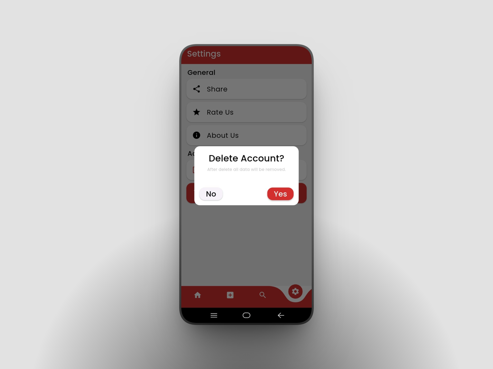
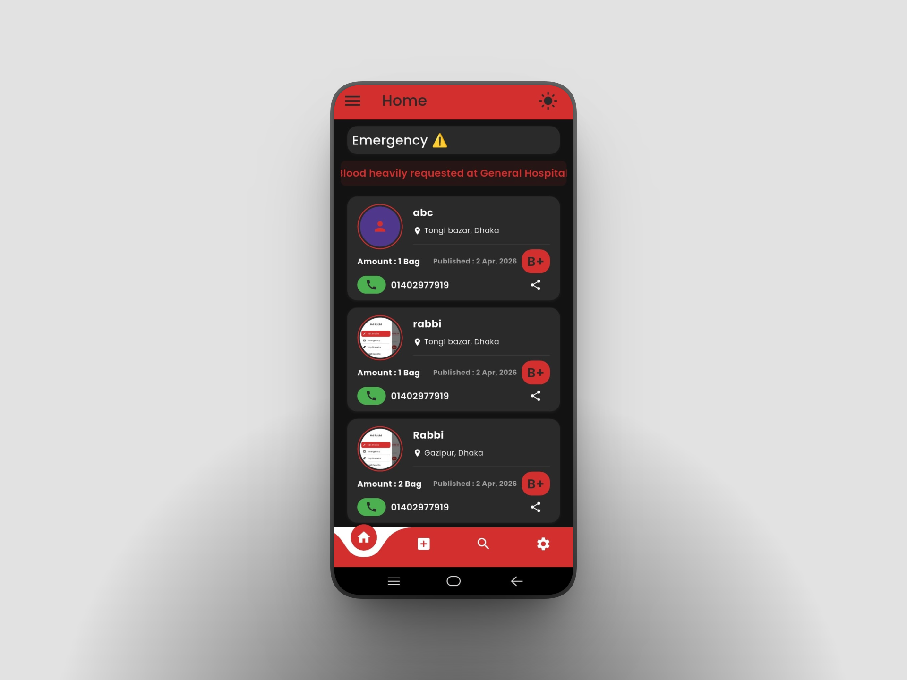
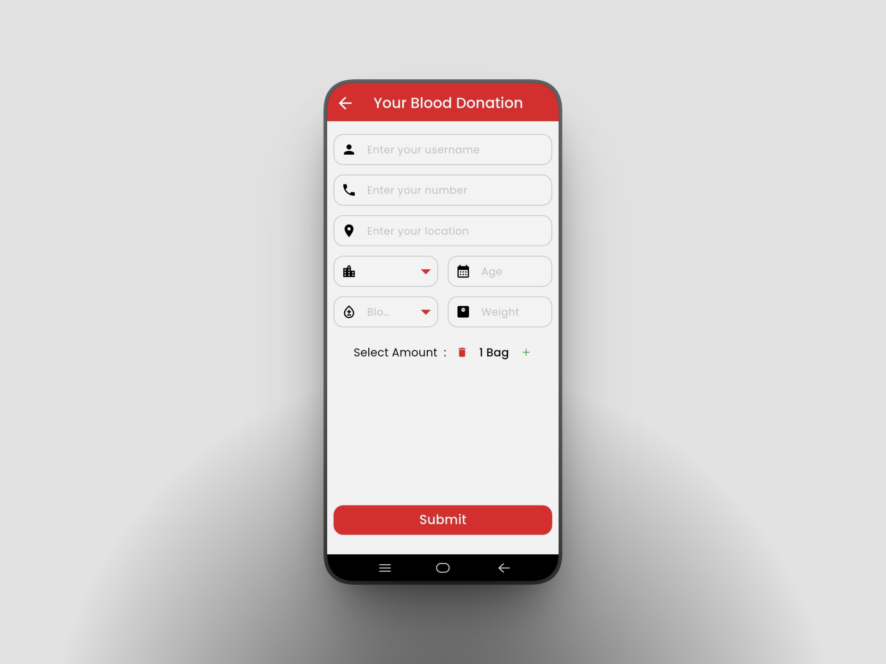
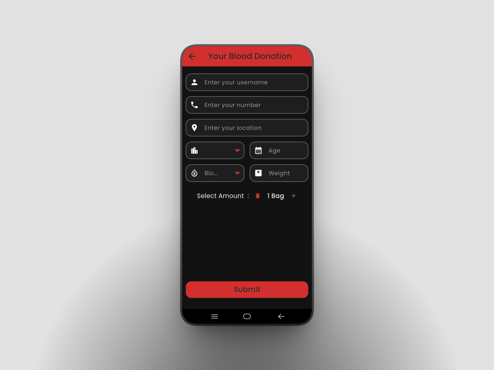
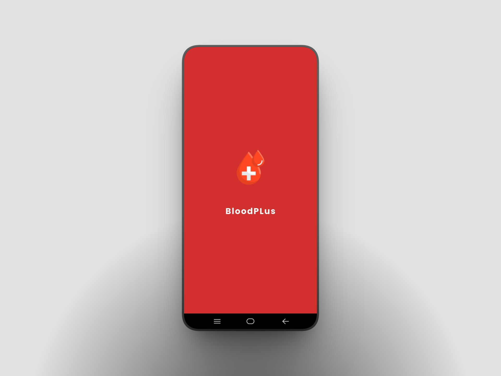
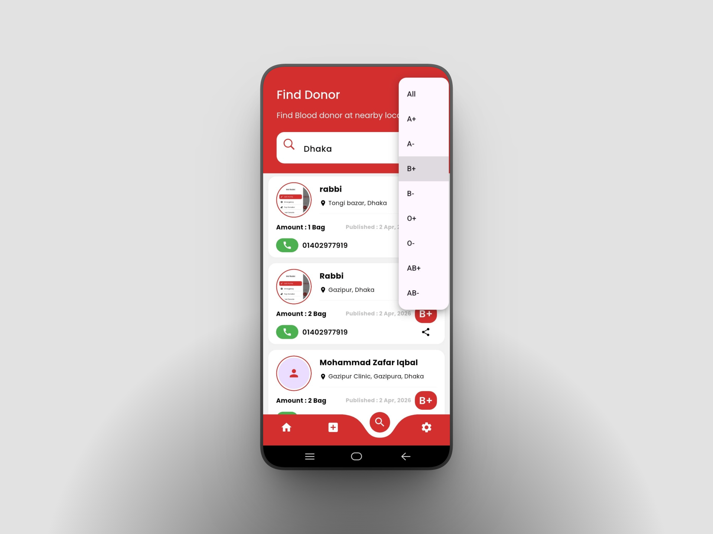
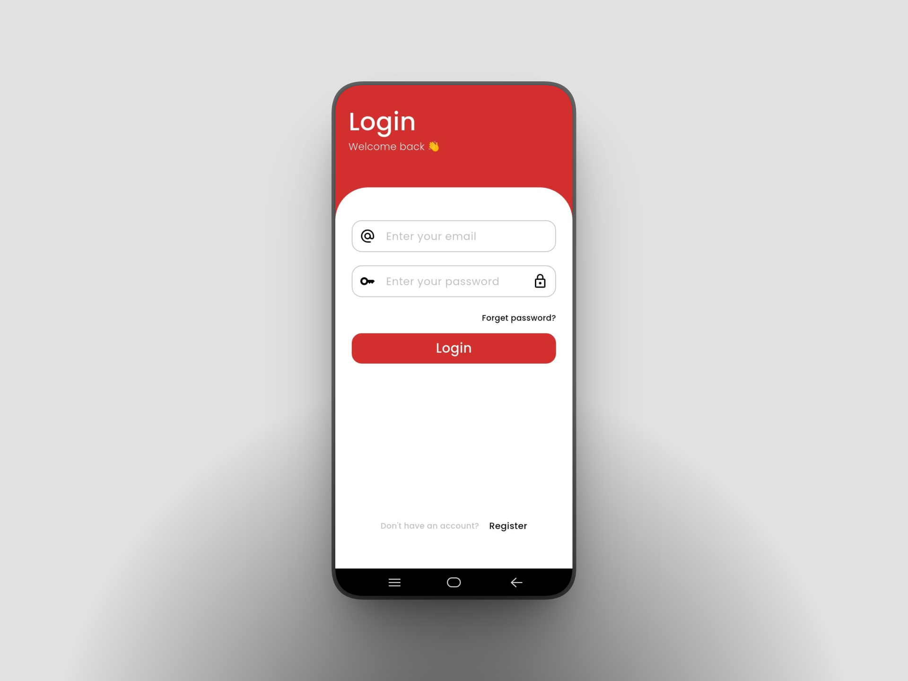
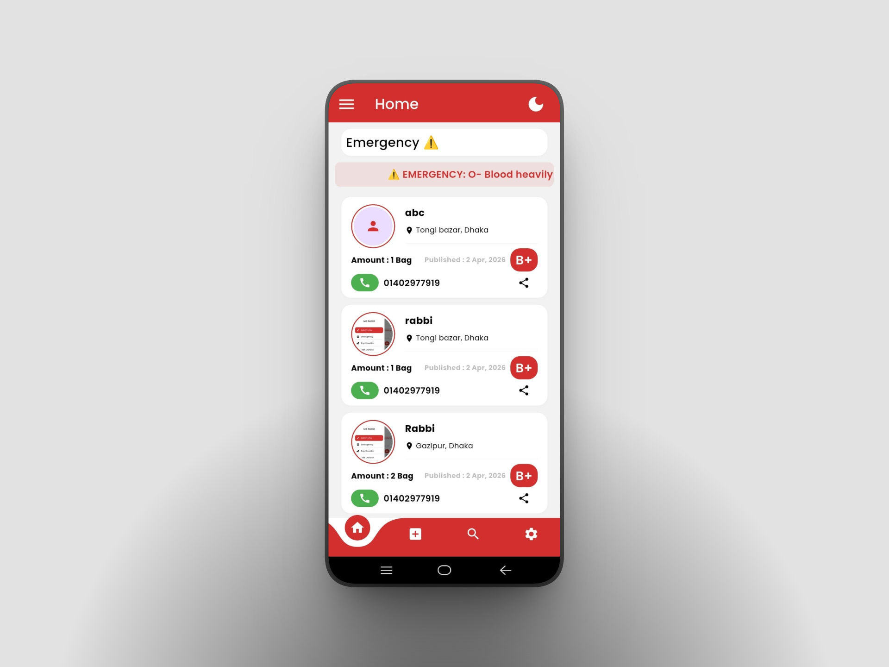
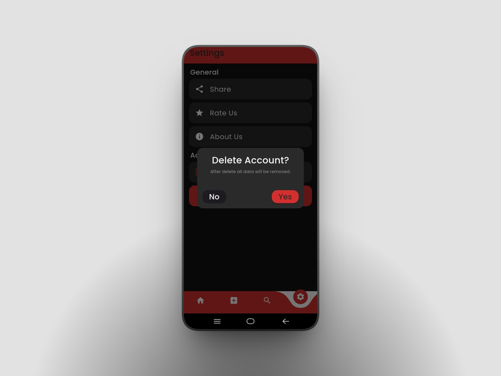

# Bloodplus - Blood Donation App
A complete Blood Donation Mobile Application built with Flutter and Firebase.

This app allows users to find donors, manage blood requests, and coordinate donations efficiently with a clean and user-friendly interface.

# Screenshots

# Demo Video
Youtube:  https://youtu.be/ACfAqaMOsQY?si=HEOxVxG65aHuY6sL

# Features
User Authentication (Login / Register)

Blood Donor Search & Category Filter

Request Management

Donor Profiles

Real-time Updates

Firebase Integration

Clean & Responsive UI

# Tech Stack
Flutter

Dart

Firebase Authentication

Cloud Firestore

GetX (State Management)

Google Fonts

# Author
**Rabby Khan**

Flutter Developer

# Show Your Support
If you like this project, please give it a ⭐ on GitHub!
